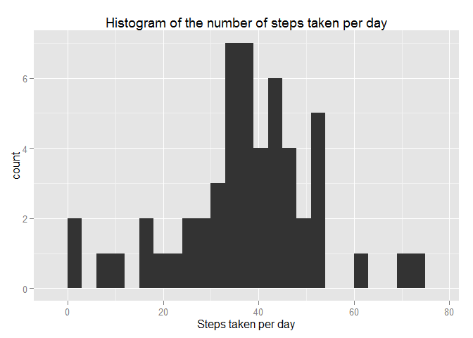
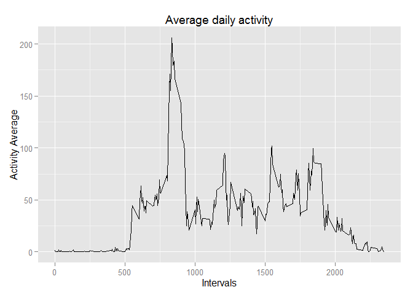
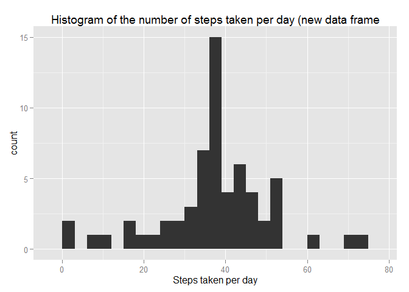

# Reproducible Research: Peer Assessment 1

This Markdown document includes the data analysis proposed in the Peer Assessment1. As all code chunks have to show the code used for the analysis, this property is set for all the chuncks included in this file:


```r
library("knitr")
opts_chunk$set(echo=TRUE)
```

  
## Loading and preprocessing the data  

### Loading the data

To load the data for the assignment, the *activity.zip* file needs to be unzipped and its content loaded to a variable, called data.


```r
dfile=unzip("activity.zip")
data=read.csv(dfile)
```

To check the data has been properly loaded, the *str* function is called to verify that the number of observations and variables are the expected ones. 


```r
str(data)
```

```
## 'data.frame':	17568 obs. of  3 variables:
##  $ steps   : int  NA NA NA NA NA NA NA NA NA NA ...
##  $ date    : Factor w/ 61 levels "2012-10-01","2012-10-02",..: 1 1 1 1 1 1 1 1 1 1 ...
##  $ interval: int  0 5 10 15 20 25 30 35 40 45 ...
```


### Preprocessing the data  
To preprocess the data, the variable called *dates* will be converted from a factor variable to a date data format


```r
data$date=as.Date(data$date)
class(data$date)
```

```
## [1] "Date"
```


## What is mean total number of steps taken per day? 
To compute the mean total number of steps per day, data are going to be splitted by date and the mean of each block is going to be computed (ignoring the NA values as stated in the assignment's instructions). To achieve this, the *aggregate* function is going to be used  


```r
steps_per_day <- aggregate(steps ~ date, data, mean)
str(steps_per_day)
```

```
## 'data.frame':	53 obs. of  2 variables:
##  $ date : Date, format: "2012-10-02" "2012-10-03" ...
##  $ steps: num  0.438 39.417 42.069 46.16 53.542 ...
```

To plot the histogram of the number of steps taken per day, the qplot function from the ggplot2 library is going to be used.


```r
library(ggplot2)
qplot(steps_per_day[,2],binwidth =3,xlab="Steps taken per day",main="Histogram of the number of steps taken per day")
```

 

Finally, the mean and median values of the number of steps taken per day is computed:


```r
mean(steps_per_day[,2])
```

```
## [1] 37.3826
```


```r
median(steps_per_day[,2])
```

```
## [1] 37.37847
```


## What is the average daily activity pattern?

To compute the average daily activity pattern, data are going to be split by the time intervals and averaged for each of them: this is achieved by the *aggregate* function.


```r
av_daily_activity <- aggregate(steps ~ interval, data, mean)
str(av_daily_activity)
```

```
## 'data.frame':	288 obs. of  2 variables:
##  $ interval: int  0 5 10 15 20 25 30 35 40 45 ...
##  $ steps   : num  1.717 0.3396 0.1321 0.1509 0.0755 ...
```

The plot for the average daily activity pattern is created with the ggplot2 library:


```r
qplot(av_daily_activity[,1],av_daily_activity[,2],geom="line",main="Average daily activity",xlab="Intervals",ylab="Activity Average")
```

 

Finally, the interval that contains the maximum number of steps, in average, is computed:


```r
av_daily_activity[which.max(av_daily_activity[,2]),1]
```

```
## [1] 835
```


## Imputing missing values  
### Looking for missing values

First of all, the number of missing values per column is computed:


```r
colSums(is.na(data))
```

```
##    steps     date interval 
##     2304        0        0
```
Afterwards, in order to define a strategy to replace those missing values, it is important to check how they are distributed in the data frame.


```r
data_split_by_day=split(data$steps,data$date)
naSums=sapply(data_split_by_day,function(x) sum(is.na(x)))
unique(naSums)
```

```
## [1] 288   0
```

All NAs in the database are placed such that, for a particular date, every time interval has either all missing values or all its values. Therefore, to replace NAs for this particular dataset, we cannot use data of the same date. A possible replacement strategy would be using for each time interval the average steps of all the available dates at this particular time. As we have previously computed this average values, in the *av_daily_activity* variable, those results will be used to replace the existing NAs. 


### Replacing missing values

Considering that the number of NAs is a multiple of the legnth of the *av_daily_activity* vector, we can replace NAs just by using a direct assignment of the *av_daily_activity* to the positions of the *new_data$steps* variable where a NA is detected.


```r
new_data=data
new_data$steps[is.na(new_data$steps)]=av_daily_activity[,2]
```

As we have included the average of all other days in the positions where no values were available the mean remains exactly the same but the median suffers a pretty small change converging to the mean value.


```r
new_steps_per_day <- aggregate(steps ~ date, new_data, mean)
mean(new_steps_per_day[,2])
```

```
## [1] 37.3826
```

```r
median(new_steps_per_day[,2])
```

```
## [1] 37.3826
```


Finally, let's check that the new data frame has no missing values left:


```r
colSums(is.na(new_data))
```

```
##    steps     date interval 
##        0        0        0
```

This figure shows the same histogram computed before for the steps taken per day, but considering the new data frame in which missing valus have been replaced. As expected, the only change in the histogram is in the bin containing the mean value, as we have created a set of new days containing exactly the same number of steps, the mean steps per day.


```r
qplot(new_steps_per_day[,2],binwidth =3,xlab="Steps taken per day",main="Histogram of the number of steps taken per day (new data frame")
```

 


## Are there differences in activity patterns between weekdays and weekends?

A new factor variable containing the information of whether the indicated date belongs to a weekday or a weekend is created, and called *wdays*. 


```r
Sys.setlocale("LC_TIME", "English")
```

```
## [1] "English_United States.1252"
```

```r
new_data$date=as.Date(new_data$date)
ww=weekdays(new_data$date)
wdays=ww%in%c("Sunday","Saturday")
wdays=factor(wdays)
levels(wdays)=c("weekday","weekend")
new_data=cbind(new_data,wdays)
```

Using the  *aggregate* function, data are splitted by steps, as a function of intervals and weekdays. A summary of the aggregated variable is shown below:


```r
steps_time <- aggregate(steps ~ interval + wdays, new_data, mean)
str(steps_time)
```

```
## 'data.frame':	576 obs. of  3 variables:
##  $ interval: int  0 5 10 15 20 25 30 35 40 45 ...
##  $ wdays   : Factor w/ 2 levels "weekday","weekend": 1 1 1 1 1 1 1 1 1 1 ...
##  $ steps   : num  2.251 0.445 0.173 0.198 0.099 ...
```
Finally, those data are used to plot the average activity in weekdays and weekends separately:
there are differences in both plots,  mainly related to the morning and late evening activity, because activity starts earlier in weekdays and stops later in weekends. This suggests that when filling the missing values, it would have been more interesting to classify the data in weekdays and weekends and use the corresponding averages instead of using the average of all days indistinctly. 


```r
qplot(interval,steps,data=steps_time,facets=wdays~.,geom="line")
```

 
